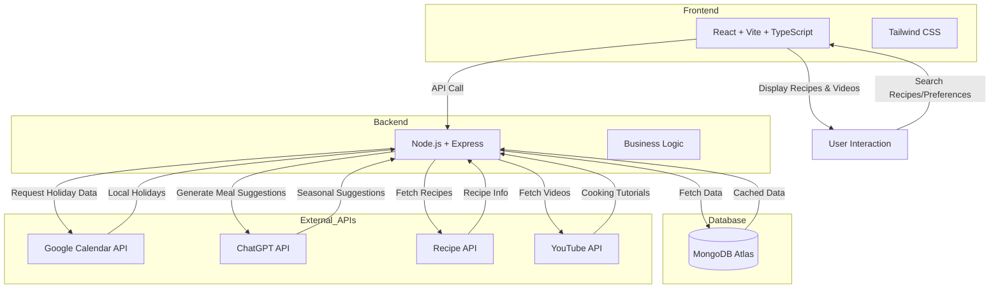

# meal-match

## Flowchart with Tech Stack

```mermaid
graph TD
    subgraph Frontend
        A[React + Vite + TypeScript]
        B[Tailwind CSS]
    end

    subgraph Backend
        C[Node.js + Express]
        D[Business Logic]
    end

    subgraph Database
        E[(MongoDB Atlas)]
    end

    subgraph External_APIs
        F[Google Calendar API]
        G[ChatGPT API]
        H[Recipe API]
        I[YouTube API]
    end

    User[User Interaction] -->|Search Recipes/Preferences| A
    A -->|API Call| C
    C -->|Fetch Data| E
    C -->|Request Holiday Data| F
    C -->|Generate Meal Suggestions| G
    C -->|Fetch Recipes| H
    C -->|Fetch Videos| I

    E -->|Cached Data| C
    F -->|Local Holidays| C
    G -->|Seasonal Suggestions| C
    H -->|Recipe Info| C
    I -->|Cooking Tutorials| C

    A -->|Display Recipes & Videos| User
```
